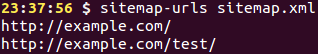

# Sitemap Urls

[](https://travis-ci.org/Rowno/sitemap-urls)
[](https://david-dm.org/Rowno/sitemap-urls)

Extract URLs from an XML sitemap.




Getting Started
---------------

Install the Sitemap Urls command line tool:
```bash
npm install -g sitemap-urls
# or
yarn add -g sitemap-urls
```

Run `sitemap-urls` on a file containing a sitemap:
```bash
sitemap-urls sitemap.xml
```

Also supports piping:
```bash
curl http://example.com/sitemap.xml | sitemap-urls
```


Usage
-----

### CLI

```
Usage: sitemap-urls <path> [<options>]

Path:
    Path to a file containing an XML sitemap.
    This parameter is ignored when the sitemap is being piped.

Options:
    -h, --help      Show this help text.
    -v, --version   Print sitemap-urls' version.
```


### API

#### `.extractUrls(string xml)` -> `array`
Extracts URLs from a string containing an XML sitemap.

Example result:
```json
[
    "http://example.com/",
    "http://example.com/test/"
]

```


Related
-------

 - [medic][] - Perform bulk URL status checks and track changes.


License
-------
Sitemap Urls is released under the MIT license.

Copyright © 2015 Roland Warmerdam.


[medic]: https://github.com/Rowno/medic
